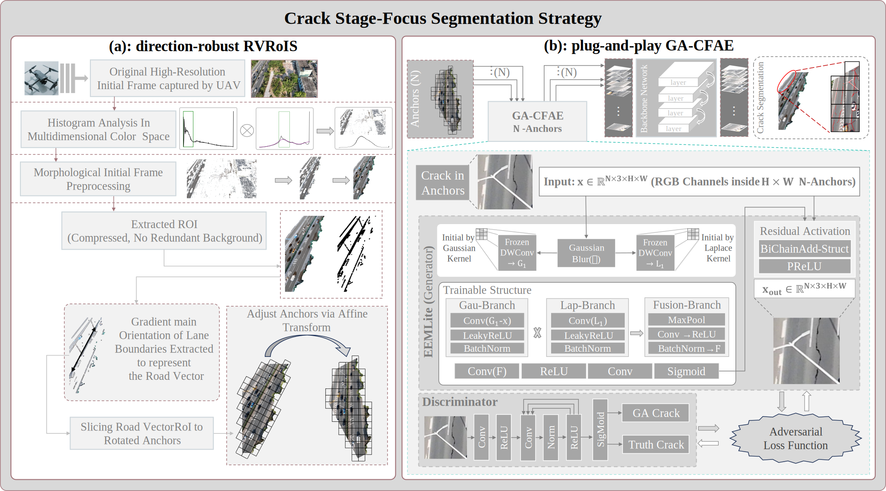
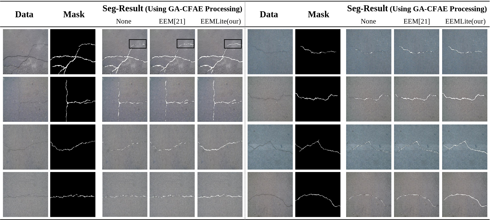
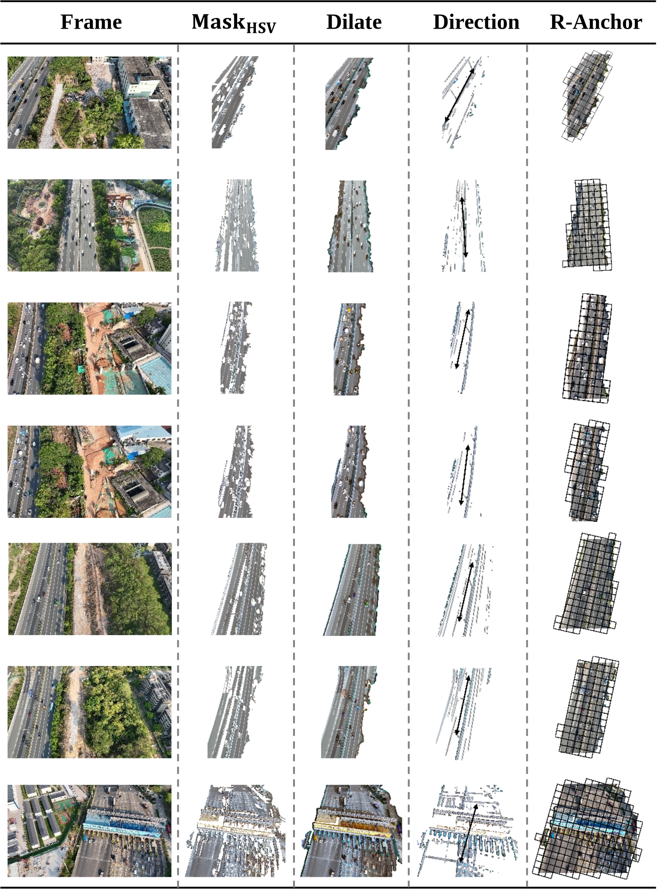

# paper: A Stage-Focused Strategy for Real-Time Small Crack Segmentation Leveraging High-Resolution UAV Road Imagery

> authors: Chongchong Yao, Nu Wen, Zhimin Zhang, Yachao Chang, Yong Fan.

>Code and Data of Paper: A Stage-Focused Strategy for Real-Time Small Crack Segmentation Leveraging High-Resolution UAV Road Imagery.
We will continue to update the data and code corresponding to the paper.

Hardware environment for this technical experiment: 

> (1) Personal Computer (RTX4060), Based on NVIDIA Ada Lovelace architecture (TSMC 4N process), it has 3,072 CUDA cores (Compute Capability 8.9, requiring CUDA 12.0 or higher) and 8GB GDDR6 video memory (272 GB/s bandwidth). With 15.11 TFLOPS FP32 throughput and 242 AI TOPS, it handles AI training and testing tasks.  
> (2) Cloud Server (RTX3090), Based on NVIDIA Ampere architecture (8nm process), it has 10,496 CUDA cores (Compute Capability 8.6, requiring CUDA 11.0 or higher), 24GB GDDR6X memory (936 GB/s bandwidth), and 35.5 TFLOPS FP32 throughput — ideal for mid-high AI tasks. 
> (3) Edge Device (NVIDIA Jetson Xavier developer kit), featuring a Volta GPU with 384 CUDA cores and 48 Tensor Cores (compute capability sm_72), delivering up to 21 TOPS (INT8) depending on the power mode, and equipped with up to 16 GB 128-bit LPDDR4x memory — suitable for lightweight and efficient edge AI deployments. 
> (4) Drone (DJI M300RTK, Camara: ZenmuseH20T), Its video imaging system includes a 20MP zoom camera (1/1.7" CMOS) supporting 4K (3840×2160) @30fps and 1080P@30fps, a 12MP wide-angle camera (1/2.3" CMOS) with 1080P@30fps, and a thermal camera (640×512@30Hz). All record in MP4 (H.264). 

>The required environment is Python 3.11.11 (all packages in the code are installed based on Python 3.11.11). 
>The pretrained model weight in the another branch: master 
>
>our Custom-Dataset data: https://pan.baidu.com/s/1LQK4diDD0AxcO7prMDsMFA?pwd=8888
>

# Compare our with EEM[21] and non-GA-CFAE module:

# RV-RoIS:

